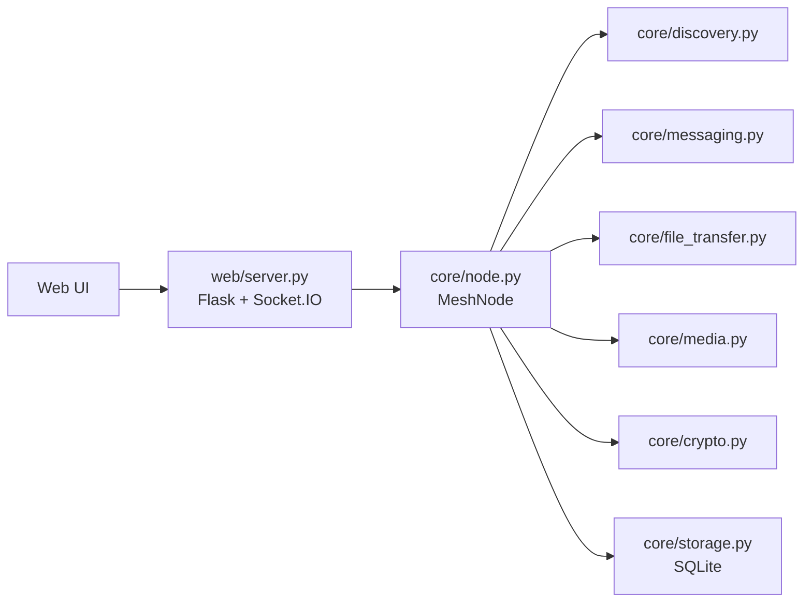

# Hex.Team MeshLink

Децентрализованная система связи для локальной сети (LAN) и прямых P2P-соединений: обнаружение узлов, защищённый чат, передача файлов и real-time коммуникация без центрального сервера.

README приведён в соответствие с фактической реализацией и структурой ТЗ «Hex.Team — Система децентрализованной связи».
Видео с демонстрацией работы проекта: https://drive.google.com/file/d/1sx_kQOuYpfUjvrz-cL4LNjZykuPfiy1r/view?usp=drivesdk

---

## 1) Цель проекта

`MeshLink` предназначен для связи в сценариях, где нет стабильного доступа к централизованной инфраструктуре:

- перегруженные локальные сети;
- закрытые площадки;
- аварийные/offline-сценарии.

Решение строит mesh-взаимодействие узлов в одном сетевом контуре и даёт текстовый чат, передачу файлов, вызовы и диагностику состояния.

---

## 2) Что реализовано

- Обнаружение узлов: UDP broadcast/multicast + статические peer-адреса через env.
- P2P-сессии между узлами.
- Обмен текстовыми сообщениями в обе стороны.
- Мультихоп-ретрансляция: flooding + TTL + dedup + relay path.
- Передача файлов: чанки, SHA-256, частичная докачка (resume), статусы прогресса.
- Real-time коммуникация: WebRTC signaling + UI-метрики (latency/loss/jitter/bitrate).
- Надёжность сообщений: ack/retry/outbox/backpressure.
- Безопасность: X25519 + AES-GCM, подписи Ed25519, seed pairing, rate limit/ban/blacklist.
- Диагностика: health/ready/metrics, network/security endpoints.

---

## 3) Стек

- Backend: Python 3.10+
- Web/API: Flask + Socket.IO
- Транспорт:
  - UDP: discovery
  - TCP: messaging + file transfer
  - WebRTC (браузер): media
- Криптография: X25519 (ECDH), AES-256-GCM, Ed25519
- Хранение: SQLite (WAL)
- UI: SPA в `templates/index.html`

---

## 4) Архитектура

```text
main.py                  — точка входа
core/
├── config.py            — конфигурация и константы
├── crypto.py            — X25519 + AES-256-GCM + Ed25519 + seed-pairing
├── discovery.py         — обнаружение узлов (UDP)
├── messaging.py         — TCP messaging, ACK/retry/outbox/relay
├── file_transfer.py     — чанковая передача файлов, resume, integrity
├── media.py             — UDP media engine + метрики
├── node.py              — оркестратор подсистем
└── storage.py           — SQLite storage
web/
└── server.py            — HTTP API + Socket.IO
templates/
└── index.html           — web-клиент
```

### Архитектурная схема



### Топология

Базовый режим — mesh в пределах LAN:

```text
A ─── B ─── C
     / \
    D   E
```

- узлы обнаруживаются динамически;
- при timeout узел помечается offline/удаляется из активных;
- при отсутствии прямого канала используется ретрансляция через промежуточные узлы.

---

## 5) Запуск

### Быстрый старт

```bash
pip install -r requirements.txt
python main.py
```

UI: `http://localhost:8080`

### Демо на одной машине (3 узла)

```bash
# Узел A
python main.py --name "Alice" --web-port 8080 --tcp-port 5151 --media-port 5152 --file-port 5153 --discovery-port 5150

# Узел B
python main.py --name "Bob" --web-port 8081 --tcp-port 5161 --media-port 5162 --file-port 5163 --discovery-port 5150

# Узел C (ретранслятор)
python main.py --name "Charlie" --web-port 8082 --tcp-port 5171 --media-port 5172 --file-port 5173 --discovery-port 5150
```

### Параметры CLI

| Флаг | Назначение | По умолчанию |
|---|---|---|
| `--name`, `-n` | Имя узла | hostname |
| `--web-port`, `-w` | Порт web UI/API | 8080 |
| `--tcp-port`, `-t` | TCP messaging/signaling | 5151 |
| `--media-port`, `-m` | UDP media | 5152 |
| `--file-port`, `-f` | TCP file transfer | 5153 |
| `--discovery-port`, `-d` | UDP discovery | 5150 |
| `--no-browser` | Не открывать браузер автоматически | false |
| `--verbose`, `-v` | Debug-логи | false |

Статические peer-адреса discovery настраиваются через env: `MESHLINK_DISCOVERY_PEERS` (comma-separated `host[:port]`).

---

## 6) Соответствие обязательным сценариям ТЗ

| Сценарий ТЗ | Статус | Реализация |
|---|---|---|
| 1. Обнаружение узлов и список устройств | ✅ | `core/discovery.py`, `GET /api/peers` |
| 2. Установка P2P-сессии | ✅ | `core/node.py`, `core/messaging.py` |
| 3. Текстовый обмен в обе стороны | ✅ | `core/messaging.py`, Socket.IO `send_message` |
| 4. Мультихоп/ретрансляция | ✅ | relay в `core/node.py` (TTL + dedup + relay path) |
| 5. Передача файла с целостностью и статусом | ✅ | `core/file_transfer.py`, события `file_progress`/`file_complete` |
| 6. Real-time коммуникация (голос/видео) | ✅ | WebRTC signaling + метрики в `templates/index.html` |

---

## 7) Протокол и надёжность

### Сообщения

- `msg_id` для дедупликации;
- TTL + relay path для защиты от петель;
- ACK и статусы доставки;
- retry с backoff;
- outbox/очередь для недоступных пиров;
- ограничение relay-фанаута и backpressure.

### Реакция на сбои

- peer timeout + обновление списка узлов;
- retry при недоставке;
- персистентность истории/счётчиков в SQLite;
- диагностика delivery/queue/file-transfer через API.

---

## 8) Real-time звонки и метрики

### Транспорт

- signaling: Socket.IO + message channel;
- медиа: WebRTC (браузерный RTP/UDP стек).

### Методика замеров

В UI используется `RTCPeerConnection.getStats()` (период 1 секунда) + EMA-сглаживание (`alpha = 0.3`) для:

- latency (RTT),
- jitter,
- loss (delta-based),
- bitrate.

Показатели отображаются в интерфейсе в реальном времени.

---

## 9) Передача файлов

Реализовано:

- чанковая передача;
- SHA-256 контроль целостности;
- подтверждение завершения и retry;
- resume с продолжением по offset + проверка offset-хеша;
- хранение partial-файлов и докачка после разрыва;
- ограничение нагрузки (лимит активных отправок/параллелизма).

Диагностика: `GET /api/network/diagnostics`, `GET /api/transfers`.

---

## 10) Безопасность

### Реализовано

- шифрование: X25519 + AES-256-GCM;
- подпись и проверка: Ed25519;
- идентификация узлов: `node_id` + seed pairing;
- trusted-only политика для чатов/звонков/файлов;
- защита от злоупотреблений: rate limit, autoban, blacklist;
- меры против replay/loop в relay: `msg_id` + TTL + dedup + подпись.

### Короткая модель угроз

Покрываемые угрозы:

- подмена/модификация сообщений;
- replay старых пакетов;
- спам/флуд;
- деградация канала (loss/jitter/disconnect).

---

## 11) Документация и тестируемость

В репозитории есть:

- исходный код;
- этот README;
- архитектурная схема (см. раздел 4);
- диагностические endpoints (`/health`, `/ready`, `/metrics`, `/api/network/diagnostics`, `/api/security/events`);
- тесты:
  - `tests/test_messaging.py`
  - `tests/test_node.py`
  - `tests/test_file_transfer.py`
  - `tests/test_media.py`
  - `tests/test_e2e_load.py`
  - `tests/test_integration_multiprocess.py`
  - `tests/test_web_server.py`

Запуск:

```bash
python -m pytest -q
```

---

## 12) API для демонстрации

### REST

- `GET /api/info`
- `GET /api/peers`
- `GET /api/chat/<peer_id>`
- `GET /api/transfers`
- `GET /api/statistics`
- `POST /api/upload`
- `POST /api/add_peer`
- `POST /api/seed/generate`
- `POST /api/seed/pair`
- `GET /api/security/blacklist`
- `POST /api/security/blacklist`
- `DELETE /api/security/blacklist/<peer_id>`
- `GET /api/security/events`
- `GET /api/network/diagnostics`
- `GET /metrics`
- `GET /health`
- `GET /ready`

### Socket.IO

Входящие события:

- `send_message`, `typing`, `get_peers`, `get_chat`
- `start_call`, `accept_call`, `reject_call`, `end_call`
- `webrtc_offer`, `webrtc_answer`, `webrtc_ice`
- `seed_pair`, `blacklist_peer`

Исходящие события:

- `node_info`, `peers_list`, `statistics`
- `peer_joined`, `peer_left`
- `message`, `message_sent`, `message_status`
- `typing`
- `call_incoming`, `call_outgoing`, `call_accepted`, `call_rejected`, `call_ended`
- `webrtc_offer`, `webrtc_answer`, `webrtc_ice`
- `file_progress`, `file_complete`
- `security_event`, `seed_paired`, `seed_pair_result`, `blacklist_updated`

---

## 13) План демонстрации на защите

1. Поднять 3 узла и показать авто-discovery.
2. Показать P2P чат A↔B и статусы доставки.
3. Показать мультихоп A→C через B.
4. Передать файл, показать прогресс и итоговый SHA-256.
5. Показать голосовой вызов и live-метрики (latency/loss/jitter/bitrate).
6. Ввести искусственные потери (внешние средства ограничений сети), показать устойчивость и изменение метрик.
7. Показать security events, diagnostics и `/metrics`.

---

## 14) Ограничения и честные рамки

- Основной режим: LAN / единый сетевой контур.
- NAT traversal, BLE fallback, Wi‑Fi Direct fallback — не входят в базовую реализацию.
- Качество real-time зависит от сети и браузерного WebRTC-стека.
- Полноценное серверное измерение QoS звонков не реализовано; метрики считаются на клиенте через WebRTC stats API.

---

## 15) Лицензия

`The Unlicense`
