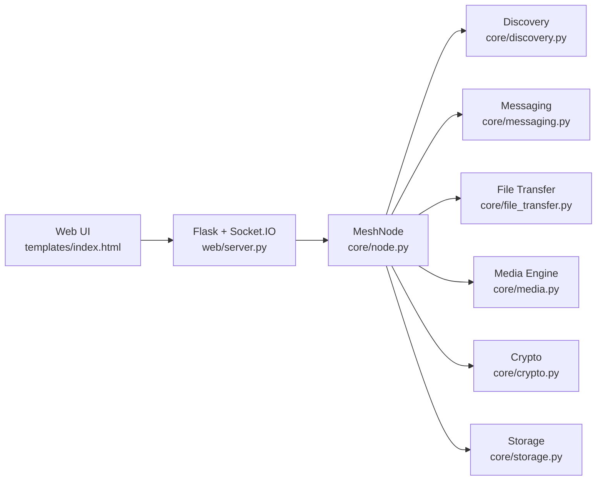

# MeshLink Architecture (Hex.Team)

## 1. High-level view

## 2. Topology and routing

- Topology: LAN mesh.
- Discovery: UDP broadcast + multicast + static peers.
- Routing: controlled flooding with:
  - `msg_id` deduplication,
  - TTL decrement,
  - relay path tracking,
  - fanout under backpressure limits.

## 3. Reliability model

- Text messaging:
  - delivery tracking (`DELIVERY_ACK`),
  - retry with exponential backoff,
  - persistent outbox and replay.
- Files:
  - chunk transfer,
  - SHA-256 integrity check,
  - partial resume with offset hash validation.

## 4. Real-time media

- Signaling over Socket.IO / messaging channel.
- Browser WebRTC for RTP transport.
- Live QoS in UI: RTT, jitter, loss, bitrate (`getStats()` + EMA).

## 5. Security model

- Key exchange: X25519 (ECDH).
- Message encryption: AES-256-GCM.
- Integrity/authenticity: Ed25519 signatures.
- Trust onboarding: seed pairing (trusted-only policy).
- Abuse controls: rate-limit, autoban, blacklist.

## 6. Group chat extension

- Added protocol message type `GROUP_TEXT`.
- Group metadata held in `MeshNode.groups`.
- Group fanout send from sender to trusted members.
- Group messages are rendered as chats with key `group:<group_id>`.

